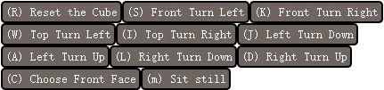
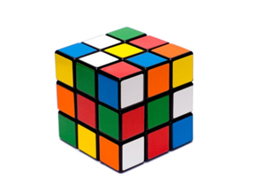
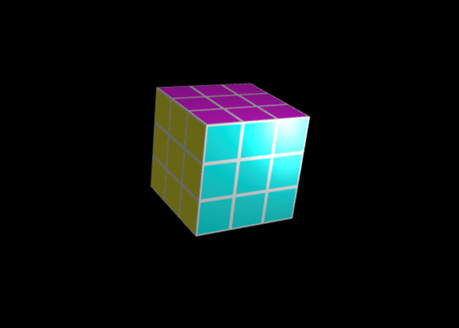

# Team Project: Rubik's Cube Master
# Team Number: 30

### Team member:

Xutong Qiu         xqiu@ucla.edu              806070771 
Zhongqian Luo      ishmael816@ucla.edu        006081523 
Haoran Cheng       290607990qq@gmail.com      405542199 
Yunhao Du          dudulu19980209@gmail.com   605543503

### Introduction:
In this project, we intend to make a computer game for a 3 by 3 by 3 Rubik's Cube. Players can also try to solve it here themselves!

### User interface：

Mouse Control: Drag-picking System 
Key Control:

| Key                  | Action                                          | 
| -------------        |:-------------:                                  | 
| Reset the Cube(R)    | Resetting the color of the Rubik's Cube         |
| Front Turn Left(S)   | Rotating the front face counter-clockwise       |    
| Front Turn Right(K)  | Rotating the front face clockwise               |
| Top Turn Left(W)     | Rotating the top face clockwise                 |
| Top Turn Right(I)    | Rotating the top face counter-clockwise         |
| Left Turn Down(J)    | Rotating the front left face clockwise          |  
| Left Turn Up(A)      | Rotating the front left face counter-clockwise  |
| Right Turn Down(L)   | Rotating the front right face clockwise         |
| Right Turn Up(D)     | Rotating the front right face counter-clockwise |
| Choose Front Face(C) | Look at the origin front face                   |

Button Control:

   

### Additional Features:
* Shadow (shadow map); 
* Reflection (sky box); 
* Textures and stylized shaders (change pipeline of vertex shader and fragment shader); 

### Technical challenges:
* Like solving a real Rubik's Cube when the player frequently treats different faces as the front face, we want our code to detect and change the front face when the user moves the camera; 
* Give each Rubik's cube a random color at the beginning while making sure it can be solved;
* Ensure the stability of the animation when the Rubik's Cube is rotating;
* How to shade 1 cube’s faces with different colors;
* How to perverse rotations(instead of rotating periodically).